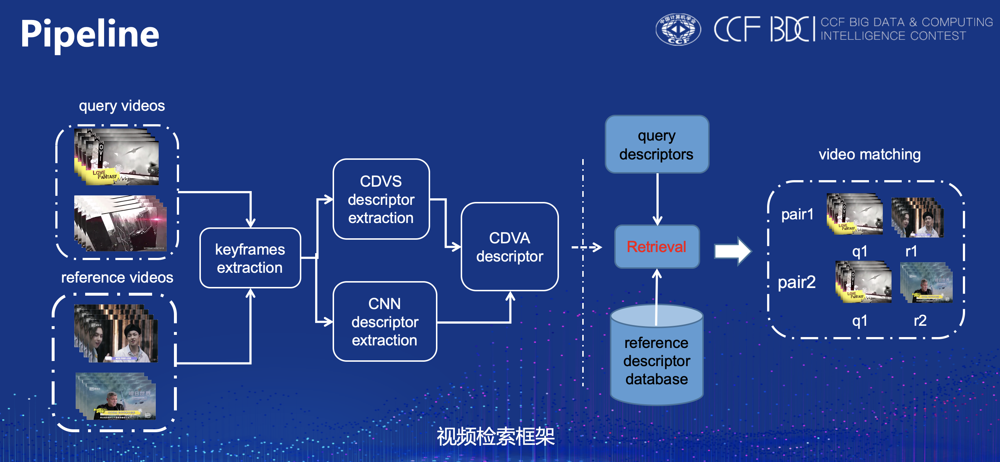
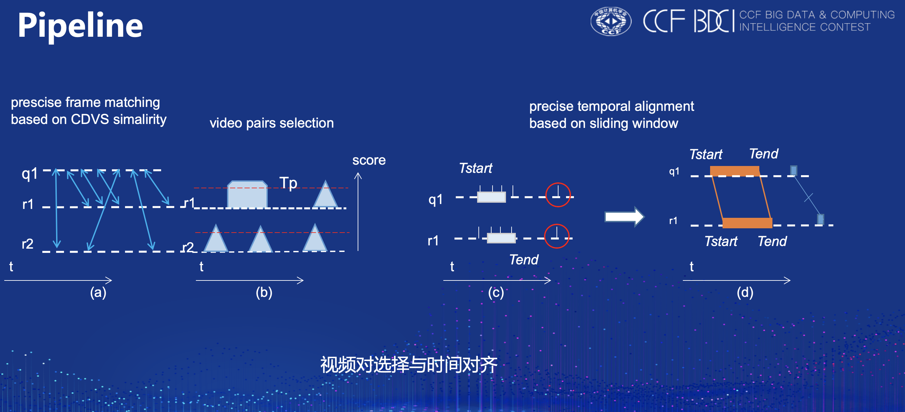
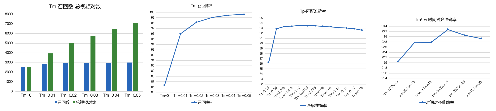

# CCF BDCI 2019视频版权检测
## 说明

CCF BDCI 2019爱奇艺视频版权检测竞赛第二名-博云视觉团队算法方案部分源码,该部分源码包括视频对重排序、视频帧提取与匹配及时间对齐操作.
视频检索、特征提取等核心代码,暂无法开源.

## 方案成绩

复赛A榜成绩F1-score=95.95%,排名第一;<br/>
复赛B榜成绩F1-score=93.95%,排名第三;<br/>
决赛第二名.

## Pipeline

<center class="half">

</center>
<br/>
<center class="half">

</center>

[[说明论文地址]](https://discussion.datafountain.cn/questions/2236)

## 文件目录
```text
query_results_process.py - 读取视频检索的csv结果文件,选取topK结果用于重排序;
extract_image.py - 视频对的帧图片提取;
cdvs_gen_scores.py - 对视频对进行帧匹配,生成匹配分数;
cdvs_matching.py - 使用cdvs分数重排序视频对和时间对齐;
```

## 实验结果
在训练验证集上的实验结果.
<center class="half">

</center>
